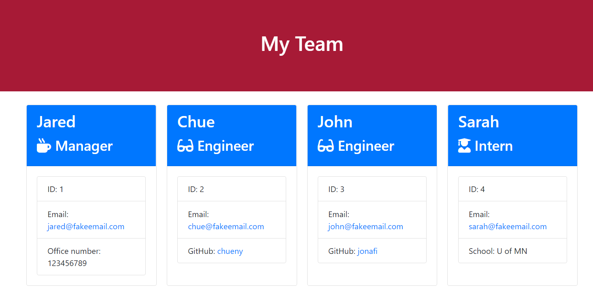
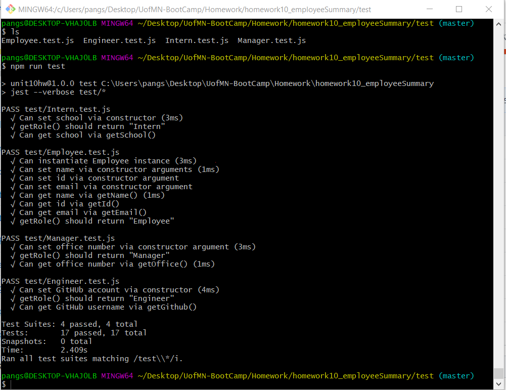

# homework10_employeeSummary

## Project Description
In this activity, we were tasked with building an employee team generator command line application. The application will prompt the user for information about the team manager and then information about the team members. The user can input any number of team members, and they may be a mix of engineers and interns. This assignment had to also pass all unit tests. When the user has completed building the team, the application will create an HTML file that displays a nicely formatted team roster based on the information provided by the user. The activity is framed as follows:

```
As a manager
I want to generate a webpage that displays my team's basic info
so that I have quick access to emails and GitHub profiles
```

## The following video demonstrates the employee team generator functionality:
## [Employee Team Generator video LINK](https://drive.google.com/file/d/1WQ7_1CzzU9iFKgFZ74CyomczF0zS4rRq/view)



## How was this delivered?
* Using the [Inquirer npm package] to prompt the user for their email, id, and specific information based on their role with the company.

* The application is running as a Node CLI to gather information about each employee.

* The dependencies are, [jest](https://jestjs.io/) for running the provided tests, and [inquirer](https://www.npmjs.com/package/inquirer) for collecting input from the user.



